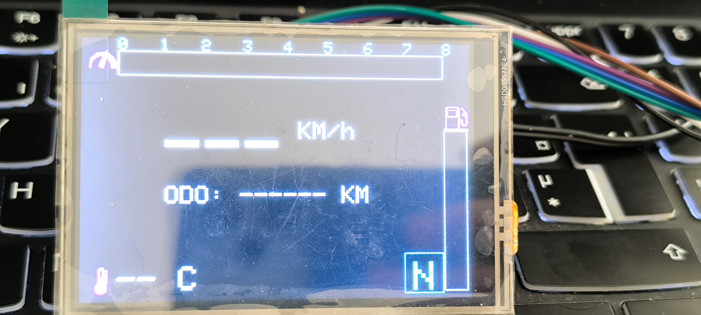

# BMW R1200GS K25 CAN Receiver Dashboard

An ESP32-based digital dashboard for the BMW R1200GS K25 motorcycle that receives CAN bus telemetry data via ESP-NOW protocol and displays it on a 3.5" TFT display.

## Overview

This project implements a custom instrument cluster display for the BMW R1200GS K25 that receives CAN bus data transmitted wirelessly via ESP-NOW from a remote ESP32 sender mounted on the vehicle. The dashboard displays real-time motorcycle telemetry including engine RPM, speed, fuel level, oil temperature, gear position, odometer, and turn signal status.



## Hardware Requirements

- **Microcontroller**: ESP32 (with ESP-NOW support)
- **Display**: ILI9486 3.5" TFT SPI Display (480x320 pixels)
- **Communication**: ESP-NOW (built-in WiFi protocol)

## Pin Configuration

| Function | Pin |
|----------|-----|
| TFT Chip Select (CS) | GPIO 10 |
| TFT Data/Command (DC) | GPIO 4 |
| TFT Reset (RST) | GPIO 5 |
| TFT MOSI | GPIO 7 |
| TFT MISO | Not used (-1) |
| TFT SCLK | GPIO 6 |

## Screen used
Datasheet of the used screen can be found [here](https://www.lcdwiki.com/3.5inch_RPi_Display)

## Data Structure

The receiver expects data packets with the following structure:

```c
typedef struct {
  uint16_t rpm;           // Engine RPM (0-8000)
  uint8_t fuelLevel;      // Fuel percentage (0-100%)
  uint8_t oilTemp;        // Oil temperature in Celsius
  uint8_t speed;          // Speed in KM/h
  uint8_t gear;           // Gear position (0=N, 1-6=gears)
  uint8_t infoButton;     // Button status (4=Off, 5=Short Press, 6=Long Press)
  uint16_t blinkers;      // Blinker status (0=Off, 1=Left, 2=Right, 3=Both)
  int odometer;           // Odometer reading in KM
} canData_t;
```

## Display Features

The dashboard displays the following information:

### Main Gauges
- **RPM Gauge**: Horizontal bar graph (0-8000 RPM) with numerical ticks
  - Yellow when < 6000 RPM
  - Red when ≥ 6000 RPM
  
- **Speed Display**: Large text showing current speed in KM/h
  
- **Fuel Gauge**: Vertical bar on the right side showing fuel level (0-100%)
  
- **Oil Temperature**: Displays current oil temperature in Celsius with thermometer icon

### Indicators
- **Gear Indicator**: Centered display showing current gear position
  - "N" in yellow for neutral
  - Numeric values for gears 1-6
  
- **Blinker Indicators**: Left and right arrow icons that light up when blinkers are active
  - Yellow arrows when active
  
- **Odometer**: Trip distance in kilometers
  
- **Info Button Status**: Displays button state (Off, Short Press, or Long Press)

## Features

- **Real-time Updates**: Display updates at approximately 20 FPS (50ms refresh rate)
- **Efficient Rendering**: Only updated sections are redrawn to minimize flicker
- **Icons**: Custom XBM format icons for gas, oil temperature, RPM, and blinker indicators
- **Color Coding**: Different colors for different states (warning colors for high RPM)
- **ESP-NOW Protocol**: Low-latency wireless communication

## Installation

1. Install the required libraries in Arduino IDE:
   - SPI (built-in)
   - [ILI9486_SPI](https://github.com/jaretburkett/ILI9486)
   - WiFi (built-in)
   - esp_now (built-in)

2. Upload the `can_receiver.ino` sketch to your ESP32

3. Ensure the corresponding ESP-NOW sender is also configured and transmitting data

## Communication

The receiver automatically initializes ESP-NOW and registers a callback (`OnDataRecv`) to handle incoming data packets. The receiver operates in Station (STA) WiFi mode but does not connect to a network.

## Related Projects

- **ESP-NOW Sender Code**: The corresponding CAN bus data sender for the BMW R1200GS K25 is available [HERE](https://github.com/ghilesdev/R1200GS_CANSniffer)

## Notes

- The sketch includes TODO items for future enhancements: oil warning light, lamp fault indicator, and high beam indicator
- All text sizes are automatically reset to default (2) after drawing to ensure consistency
- The display uses 16-bit color format
